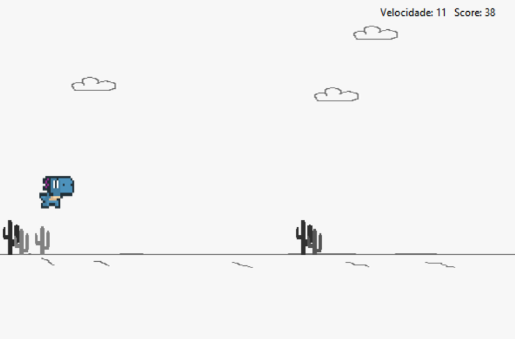
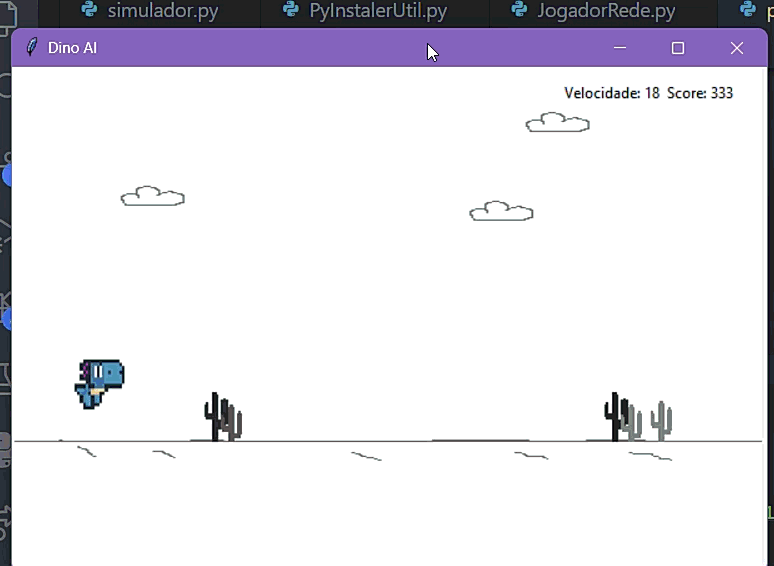

# 🦖 NEUROEVOLUÇÃO NO JOGO DO DINOSSAURO

## Descrição

Projeto que aplica **Algoritmo Genético** para evolução de redes neurais que jogam o dinossauro do Chrome. O objetivo é treinar uma rede que aprenda a sobreviver evitando obstáculos no simulador.

---
## Olha que bonitinho

---
## Agora aó o treinamento

---

## Estrutura do projeto

- **JogoComVisual/**: Código para a interface gráfica e execução visual do jogo com o dinossauro controlado pela rede treinada.  
- **RedesJaTreinadas/**: Modelos de redes neurais já treinadas, salvas para uso direto.  
- `evolucao_treinamento.py`: Script principal para treinamento das redes neurais usando algoritmo genético.  
- `playground.py`: Código para testes diversos e experimentações rápidas.  
- `rede_neural.py`: Implementação da rede neural, com métodos de mutação e forward pass.  
- `simulador.py`: Simulador do jogo do dinossauro, responsável pela lógica do jogo e avaliação das redes.

---

## Como usar

1. **Treinamento:** Execute `evolucao_treinamento.py` para rodar a evolução das redes neurais.  
2. **Visualizar:** Após o treinamento, use o código dentro de `JogoComVisual` para rodar o dinossauro controlado pela rede treinada.  
3. **Testar:** Utilize `playground.py` para experimentar outras ideias ou testar redes manuais.

---

## TL;DR
1. A técnica permitiu o aprendizado do jogo pelas redes, no final, temos redes que jogam infinitamente o jogo, sem nunca perderem
2. É legal perceber que as redes nunca aprendem a "jogar o jogo", elas aprendem a **maximizar seus pontos**, se pra isso for necessário vencer o jogo, ok, se não for... -> Uma rede descobriu como bugar o jogo e fazer o dino voar, nunca perdeu pontos e foi a maior recordista de todos os testes

